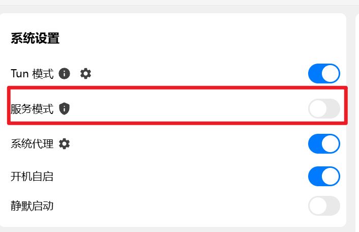

## 问题描述
```bash
$> git pull
Connection closed by 198.18.0.63 port 22
fatal: Could not read from remote repository.
```
## 原因
tun 模式用把22端口也代理了
## 解决方案
强制22端口不走代理<br>
在rule里加一行
```yaml
- DST-PORT,22,DIRECT
```
并且关闭**服务模式**

