# ios APP 降级

## 背景
田文镜，我xxx！！！  
my cadillac app 胡乱升级，把24款的车型的UI全部弄成了各个车型的默认配色。 
需要对此app降级处理

## 准备
1. itunes (必须是**12.6.5.3** 版本的)
2. iOS旧版应用下载器v6.0
3. 爱思助手8.0

## 整体思路
1. 使用**iOS旧版应用下载器**选到历史版本并触发拦截itunes
2. itunes登录apple id用于ipa文件中的身份认证
3. 在itunes中下载**iOS旧版应用下载器**所指向的app版本的ipa文件
4. **在爱思助手**中安装ipa

## 具体实操
1. 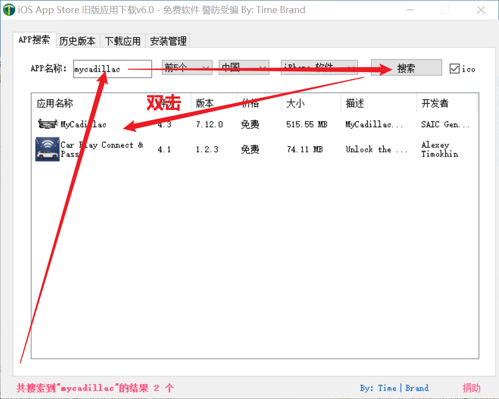
2. 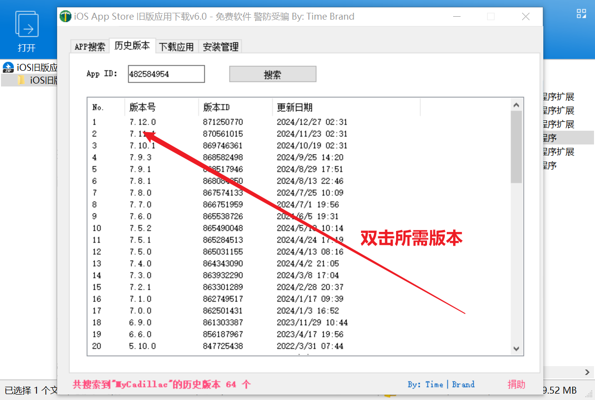
3. 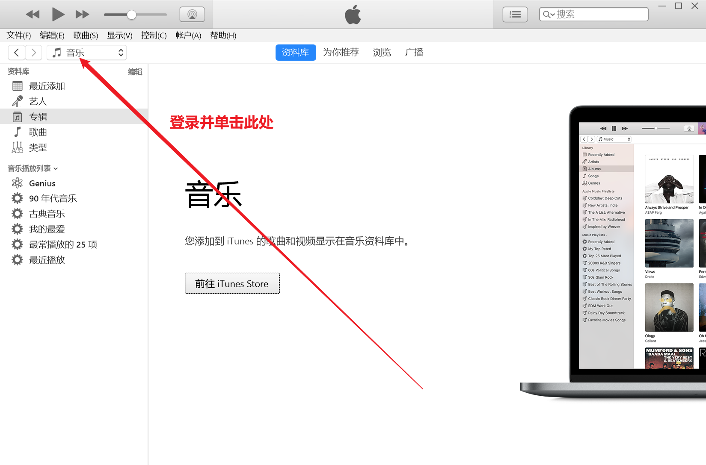
4. 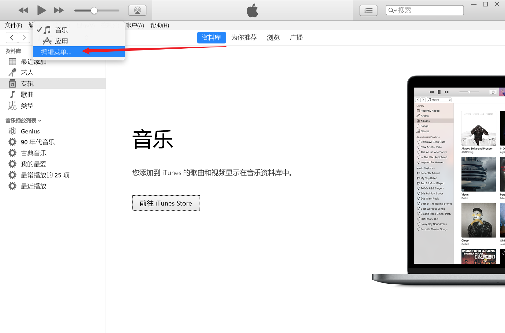
5. 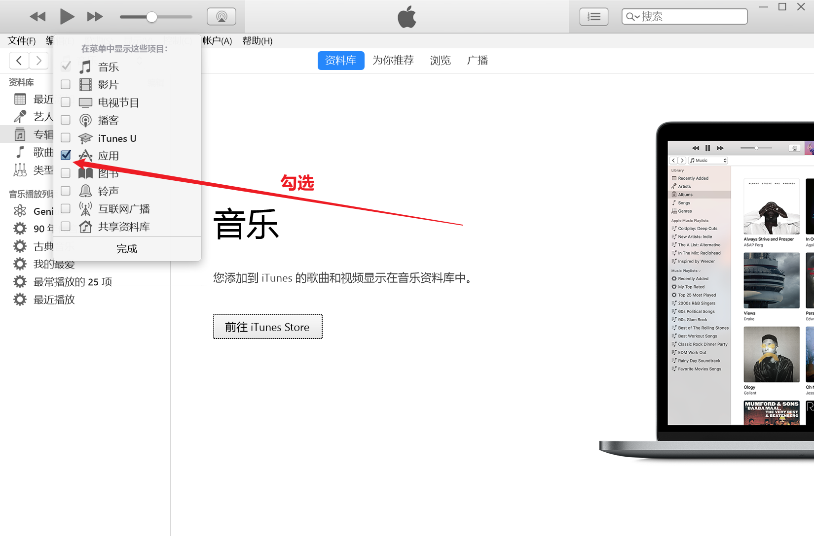
6. 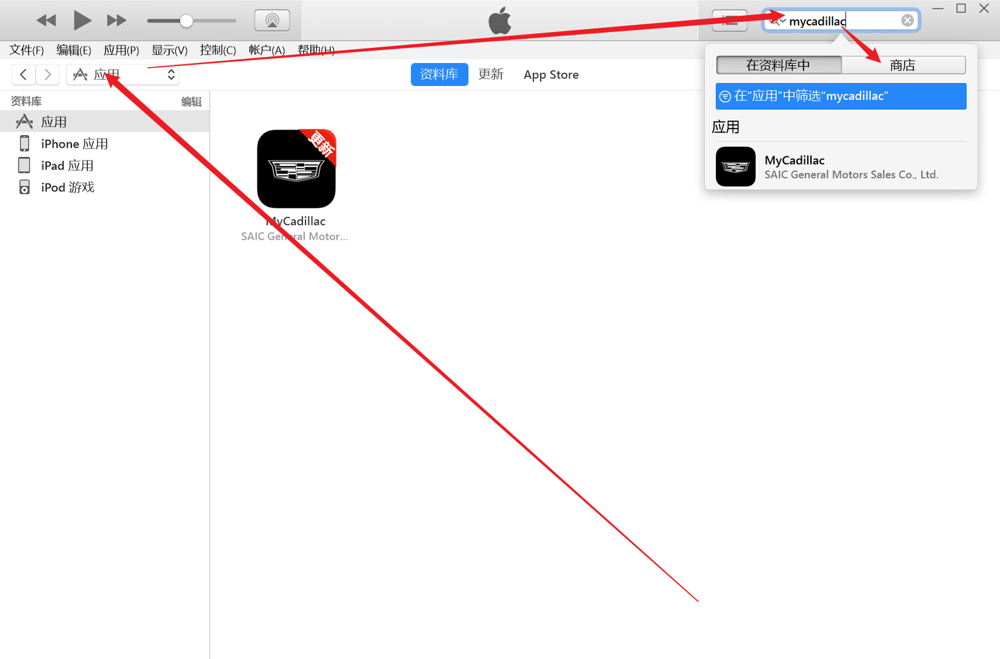
7. 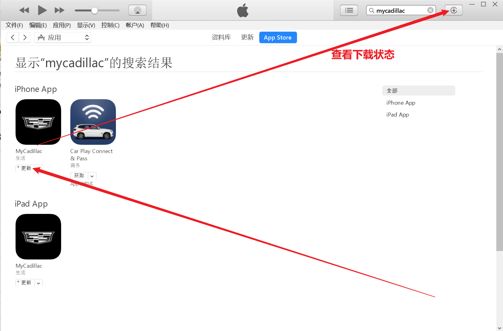
8. 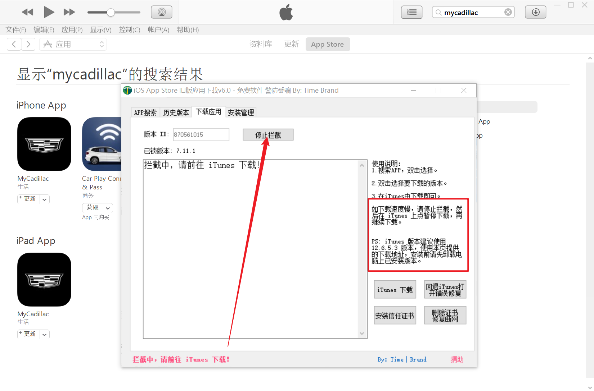
9. 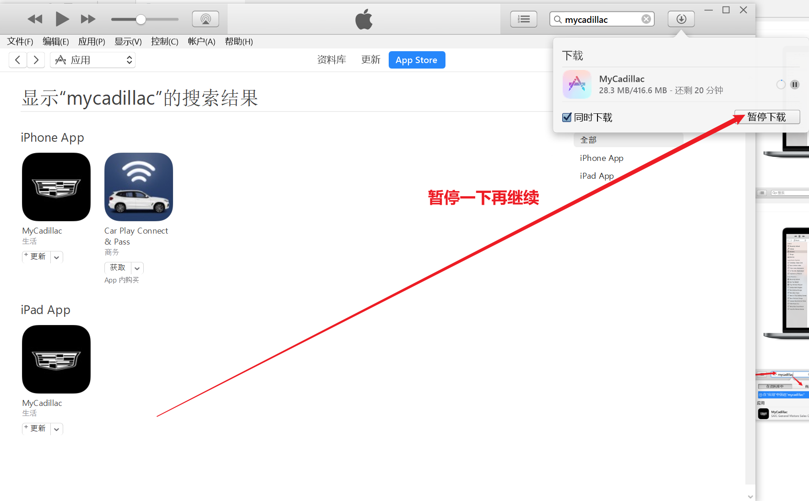
10. 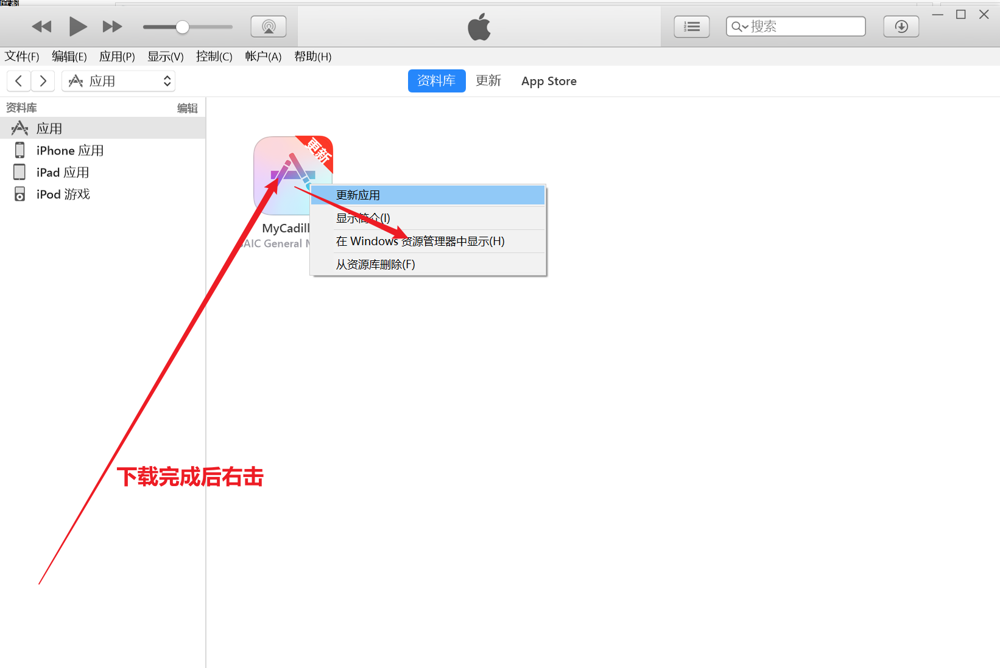
11. 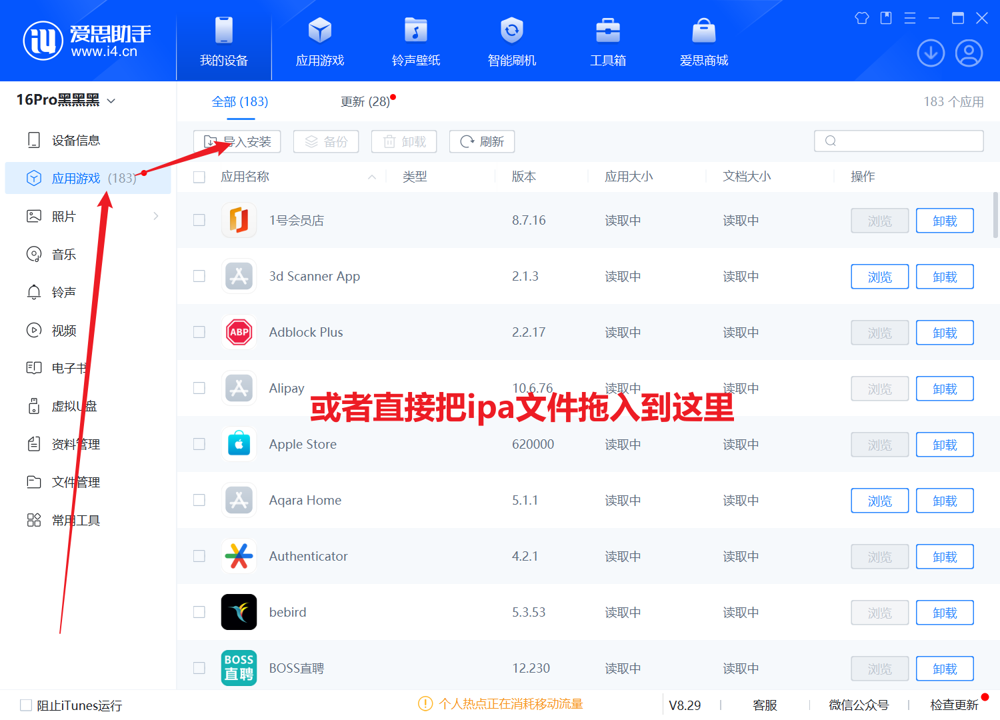