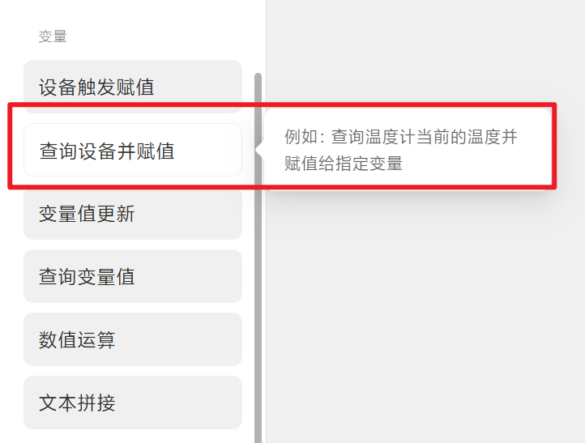
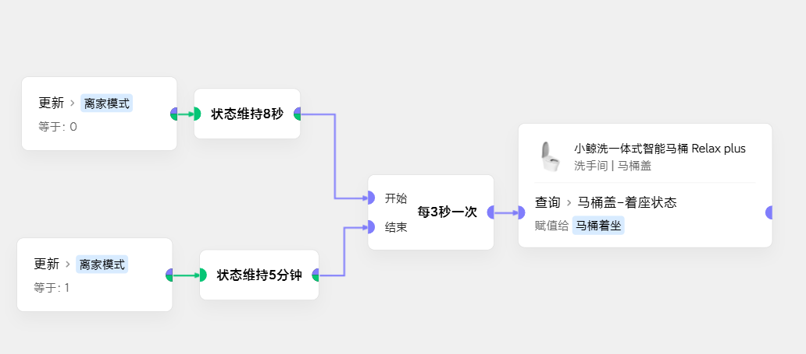
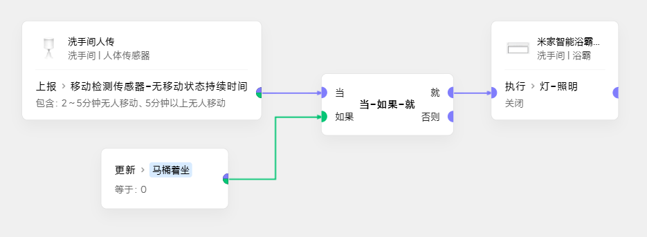

# 用变量构造出触发和状态
## 需求
- 部分设备在极客里只有**查询当前状态**，没有**事件发生或状态更新**卡片
- 但是**状态维持**、**事件触发**又是一部分场景的核心逻辑
- 部分设备在极客没有触发，在APP里有**非本地化**触发，可以通过这种方法实现**本地化**

## 思路
- 利用**循环查询**并赋值给**变量**

- 场景实际联动时，用变量来**代理**设备本身的状态

## 实例
- 小鲸洗马桶，在APP里有**非本地化**触发的离座着座条件
- 但是极客里没有**事件发生或状态更新**
- 通过这个例子实现获取到**本地化**的离座着座状态

- 状态使用：

配合人传，避免洗手间内**马桶坐人被误关灯**
## 细节
1. 循环间隔推荐最小2秒，在不影响体验的情况下，间隔越大越优雅。
2. 循环可以直接用**启用时**的卡片开始无限循环
3. 也可以根据实际情况**控制循环的开启和结束**
4. 循环查询可以单独放在一个场景里，并且用**全局变量**。减少日志污染