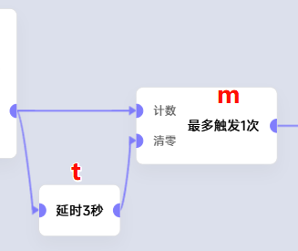
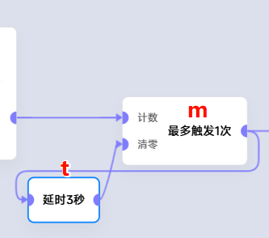

# 在 t 时间内最多执行 m 次

## 简化版本思路 (当 m == 1 时)
**3秒**内最多触发**1次**(坏的例子) 
 
- 存在细微瑕疵，实际上可能会大于延时部分(例子中的3秒)
- 极端情况下，如果事件一直以小于t的周期高频触发，则事件在执行一次后会被卡住
  
**3秒**内最多触发**1次**(好的例子) 

## 完整版思路
1. 利用**最多触发指定次数**卡片
2. 利用**延时**卡片，清零**最多触发指定次数**

## 举例
在**5秒内**最多只执行**2次** 

