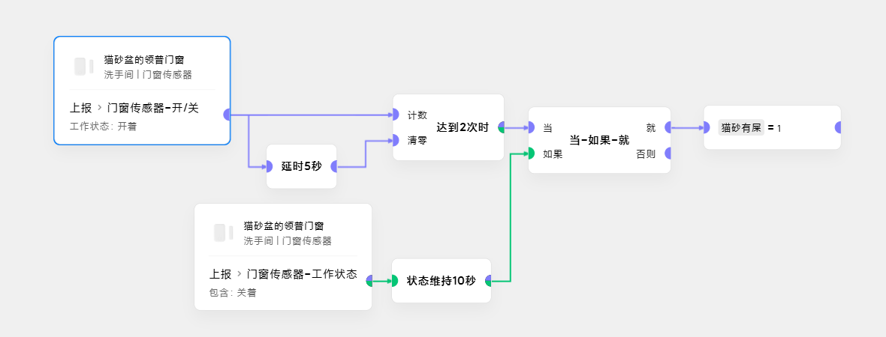
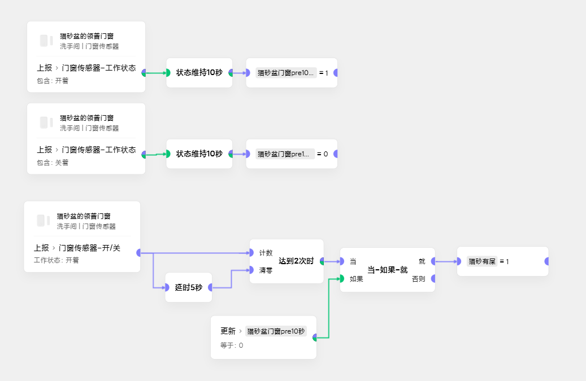

# 用变量取到设备状态变化前的稳态

## 以实际场景如例
需要把设备的状态映射成猫砂盆的两种状态：
### 状态一. 需要铲屎
   门窗5秒内连续2次**打开**视为有猫经过猫砂盆的小门
### 状态二. 铲完屎了
   门窗**打开并维持10秒**视为掀开整个猫砂盆顶盖

## 这里存在一个问题
每次**状态二**之后，合顶盖的时候很容易晃起来猫砂盆的小门 
从而再次**误判断进入状态一**

## 解决思路
- 当门窗连续2次**打开**，判断门窗之前的状态是否是**关闭状态并维持10秒**
- 于是我们有了下面这个初版(别抄，存在问题) 

- 上边的场景卡片乍一看，似乎满足判断要求。但实则在门窗被打开的时候，
下边的关闭维持就会被打破，当场景执行到**当如果就卡片**时，绿色条件一定是伪，
后面的执行卡片一定不会执行。

## 核心逻辑
- 把设备的状态保存到一个变量里，并把状态延时同步到变量里
- 判断设备之前的状态时，选用变量
- 最终版场景如下 

