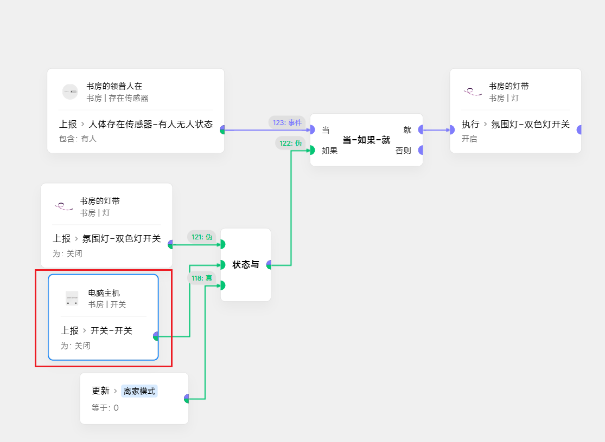
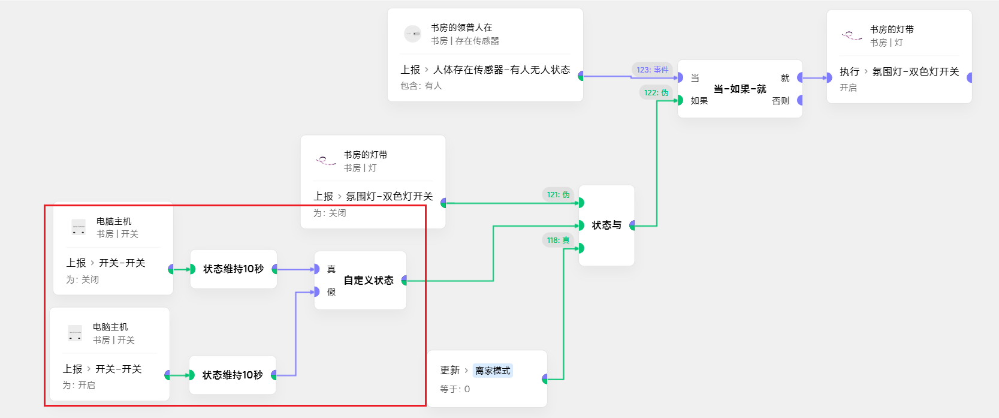
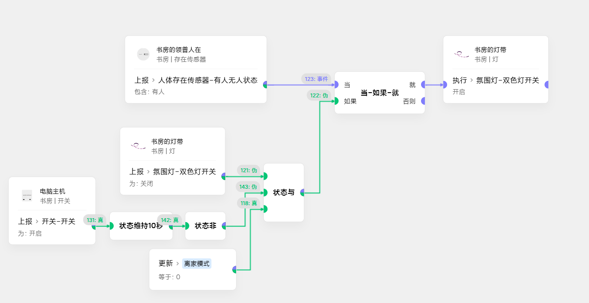

# 13_状态取反的实用场景举例
一直以为这个后期新增的卡片没有实用价值，直到......

### 以一个简单的开灯场景为例
需求是**在电脑主机关机的情况下开灯** 
最初场景是这样的： 
 
但是发现一个问题：**有时进门前先打开了主机，进门时却没开灯。**  
此时需要改进一下：**如果电脑在10秒内开机，也开灯**: 
  
但是略显冗余，此时可以换上状态取反卡片，就可以**简化场景**: 
