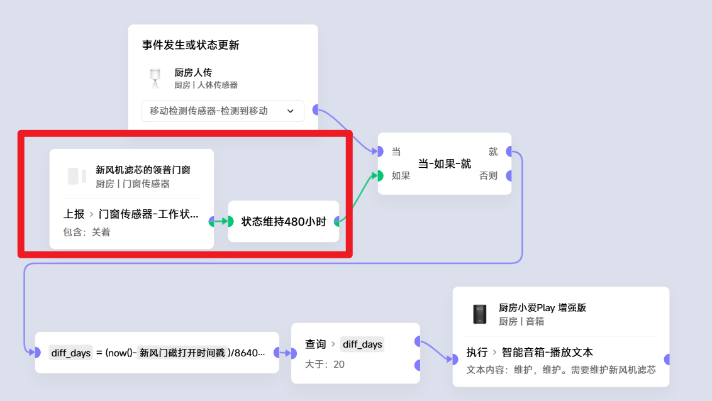
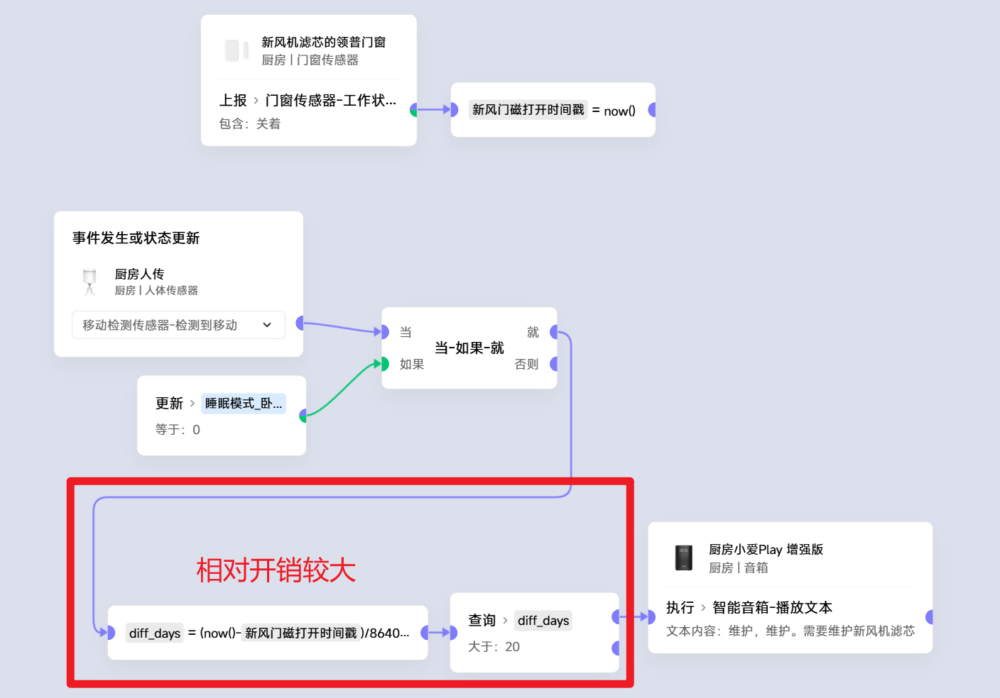
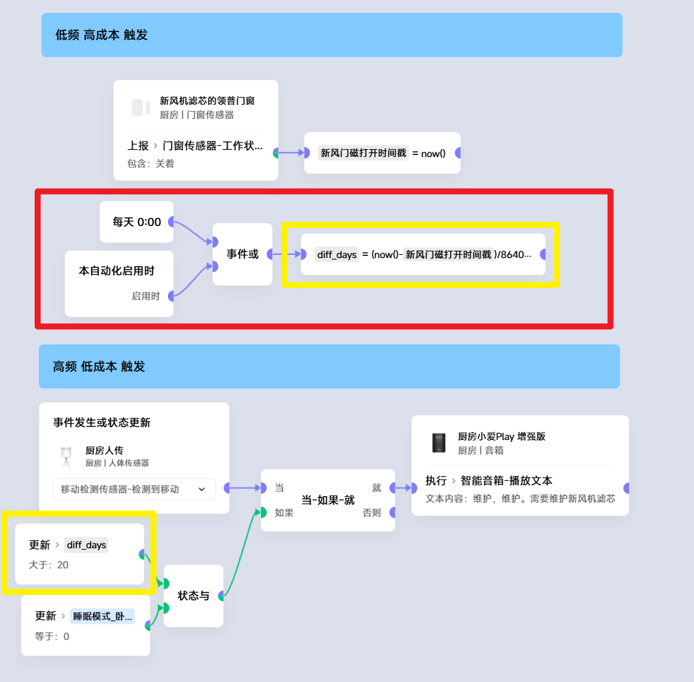

# 14 长维持逻辑场景与性能优化
### 这篇其实是两个玩法，但是由于拟合度较高，遂写到一起：
#### 1. 长时间维持
#### 2. 优化方法论————将高开销节点解耦
### 引子：
新风机厂家的维护提醒做的不好用，而且有时即使收到了提醒，人也不在家中。
等人回到家时，又忘了这回事。 
因此可以使用门窗传感器，通过智能家居联动，当感知到人在家时，提醒新风机滤芯维护
### 初版场景
 
存在**重新计时**的问题:
1. 当这个场景修改时，会重新计时
2. 断电、断网等意外，会重新计时

### 采用变量计时
1. 门窗触发关闭时，存下一个时间戳
2. 当有人时，计算距离上次维护的时长(天数)
3. 判断天数是否大于20天
4. 增加了睡眠模式下不提醒(非必要)
 

此时逻辑上没啥问题了，但从性能开销上看，
几乎每次人传触发都会调用一次now()，同时计算一次时间差。
### 计时判断解耦
1. 将计算天数的逻辑抽离，每天只执行一次
2. 为保证计算天数的逻辑不被断网、断电干扰，启用时也执行一次
3. 有人触发时，只需要判断天数>20
