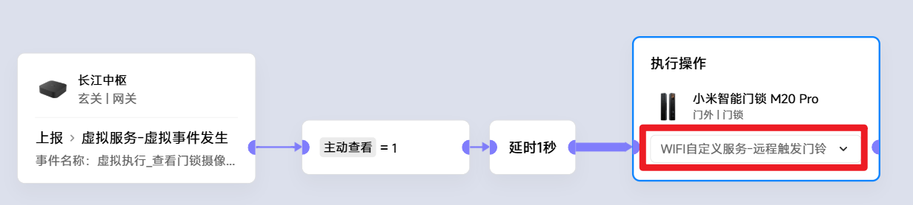
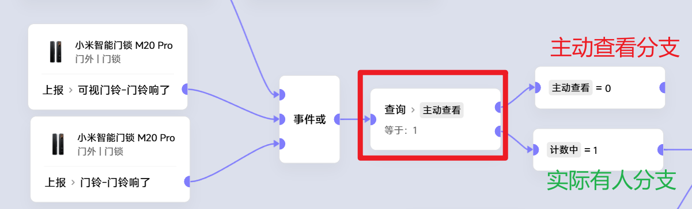

## 15 小爱屏mini查看摄像头

将摄像头类产品分为2类：
1. **摄像头类**，各种摄像机，一般都是长供电的
2. **门锁猫眼类**，一般都是电池的

### 摄像头类
需要使用**自定义指令**，指令格式： 
- 控制摄像头工作状态的开/关 
   {打开|关闭} + {房间名称} + {摄像机名称} 
   如： 打开客厅的天眼
- **查看摄像头画面**： 
   {查看画面} + {房间名称} + {摄像机名称} 
   如: 查看画面客厅的天眼

### 门锁猫眼类 (以 M20pro 为例)
1. 虚假触发有人事件
2. 极客版本中增加变量，区分主动是否真实有人
3. 对于主动查看的，忽略后续执行(闪灯、小爱提醒等常规联动)
 
 