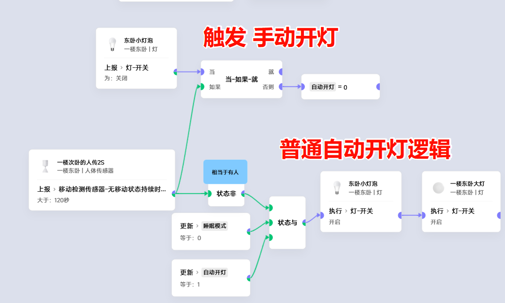
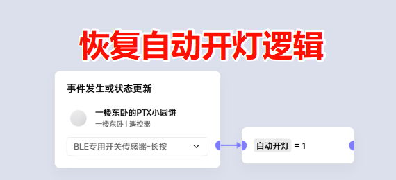

# 手自一体智能灯光

## 背景
有些时候，老人想要临时手动开关灯，此时不需要智能自动化开关灯。

## 目标
尽可能简单的切换**手动/自动**开关灯

## 初步思路
加一个**变量**，用这个变量来负责在开关灯前**判断**

## 进阶思路
- 为了更简单无感，想办法让变量也自动化
- 既然是手动，必然有**人工干预**
- 捕捉到**人工干预**，它就是切换手动/自动的**触发**
- 人工干预:
  - 当灯关闭时，传感器是有人的(说明需要强制关灯)

## 实践

## 待优化点
我们自动地触发了手动开灯， 
但却找不到什么简单的条件来触发恢复自动化开灯。
我这里简单得用一个无线开关开触发恢复了，暂时没有什么合适的自动化，小伙伴们可以尝试用蓝牙、wifi接入情况……等等条件，或者是更复杂的多传感器融合触发，只要足够多设备+足够灵活的思路，肯定是可以找到一个属于自己的触发条件的
#### 这也是智能家居的魅力所在，不是吗？ ^_^