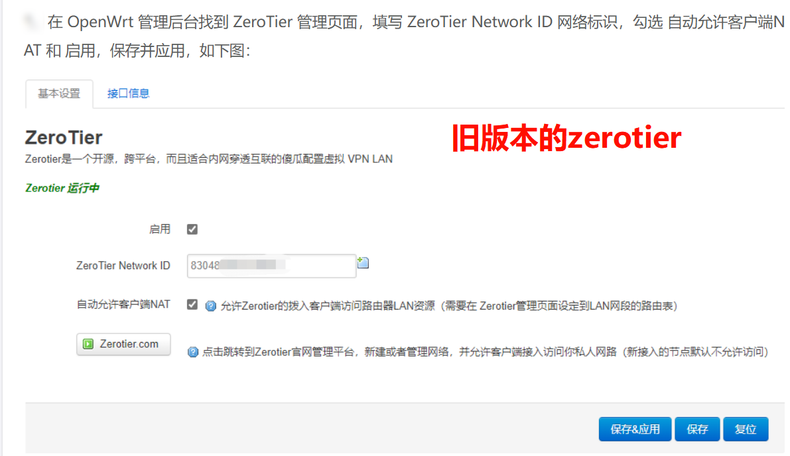
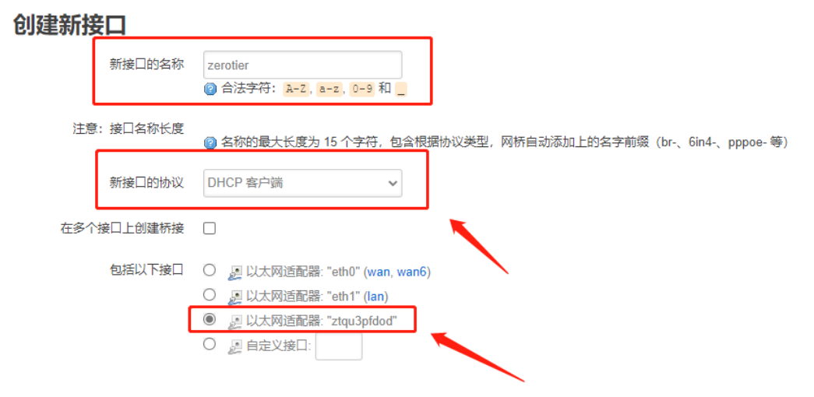
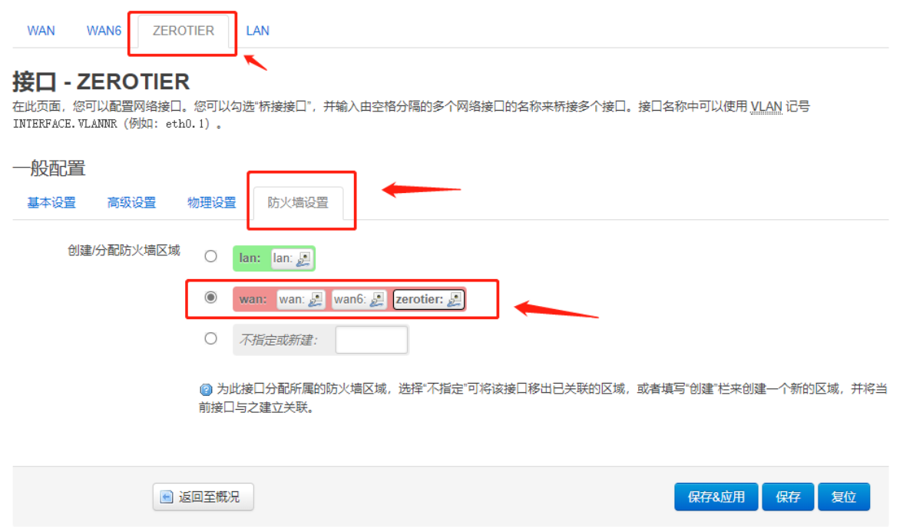
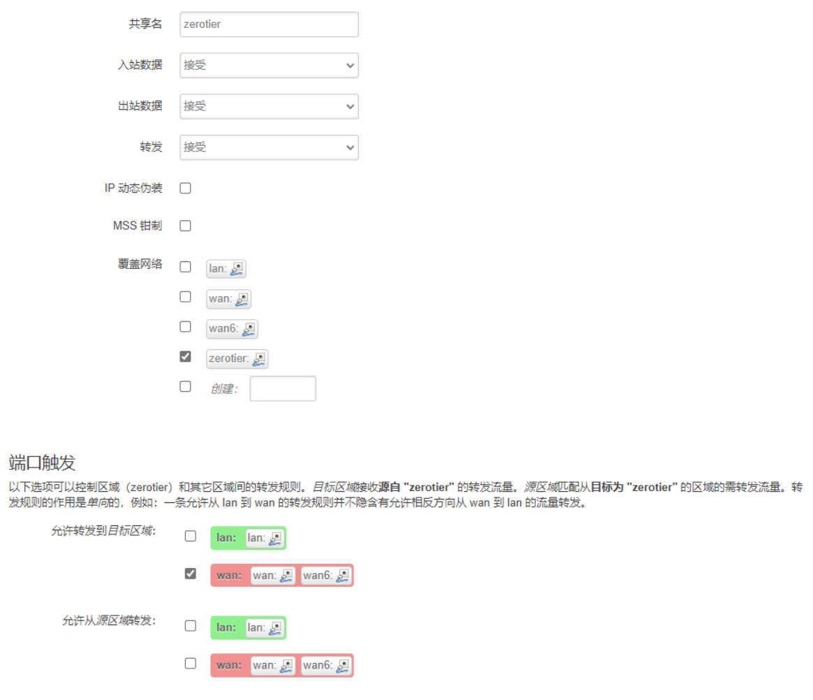
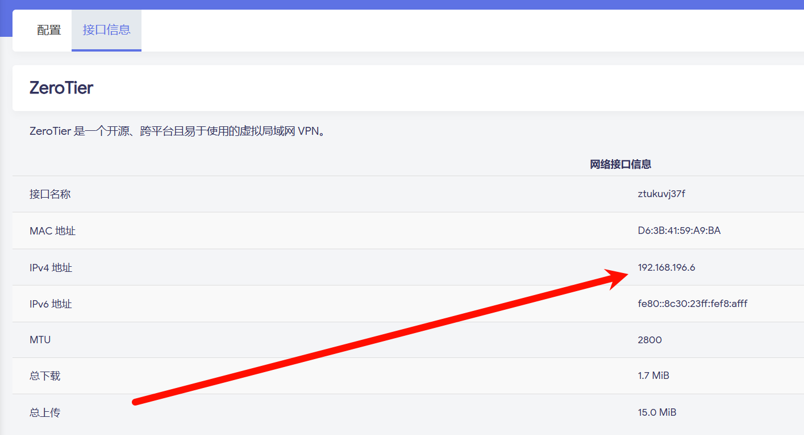
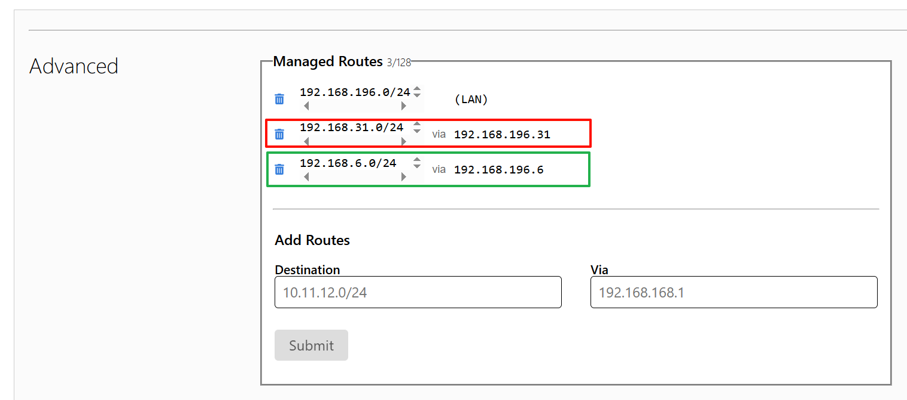

# openwrt配置zerotier实现多个局域网间互通

## 准备所需
1. openwrt中安装好zerotier cli
2. zerotier官网注册好一个局域网网络

## 开始
1. 配置openwrt中的zerotier cli
   
   
2. 设置完并启用了 ZeroTier 后，点击“**网络 > 接口 > 添加新接口**，新接口的名称 随意填写（为了方便填写为：**zerotier**），新接口的协议选择 DHCP 客户端，包括以下接口 选择 以太网适配器: **ztqu3pfdod**，这个接口名称记住，后面要用到，每个人都不一样，如下图：
   
3. 在 ZEROTIER 接口内选择防火墙设置，将 创建/分配防火墙区域 选择为 wan 或 zerotier，注意：设备不一样设置不一样，有的是单独的，如下图：
   
4. 接着点击“网络”>“防火墙”>“添加”，共享名 为了方便修改为 zerotier，入站数据、出站数据 和 转发 全部选择接受，覆盖网络 选择命名为 zerotier 的接口，允许转发到目标区域 选择为 wan 口：
   
5. 完成以上内容后，点击“网络”>“防火墙”>“自定义规则”，将以下代码的中的以太网适配器名 **ztqu3pfdod** 修改为自己的，并把代码复制到自定义规则，规则如下：
   ```
   iptables -I FORWARD -i ztqu3pfdod -j ACCEPT
   iptables -I FORWARD -o ztqu3pfdod -j ACCEPT
   iptables -t nat -I POSTROUTING -o ztqu3pfdod -j MASQUERADE
   ```
6. 进入 ZeroTier 网络配置页面，下拉到 Members（网络成员的意思），给 OpenWrt 进行设备授权，勾选 Auth
7. openwrt里看到这里得到了ipv4，就是成功了
   
8. 在Zerotier网站里新增路由表，以实现一个网段的地址都去找指定的那个zerotier客户端节点(即我们的openwrt),比如下图中的31网段和6网段，分别去找192.168.196.31和192.168.196.6对应的两个openwrt节点，**以实现在两个局域网中的所有设备能互相访问**
   