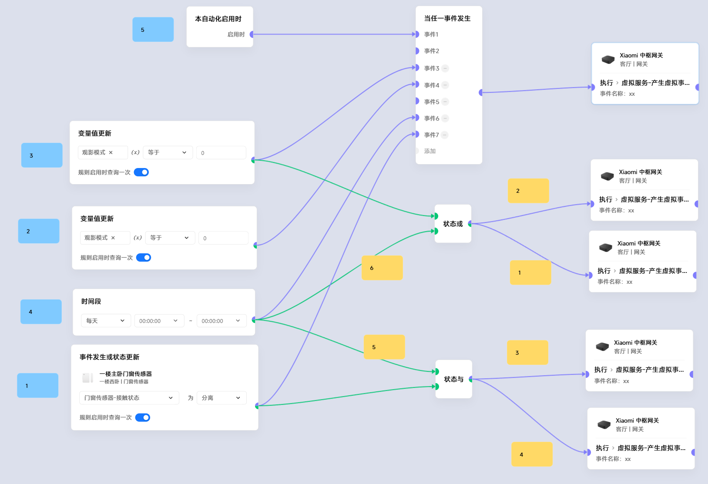

# 极客卡片传播顺序

## 前言
1. 对于执行类卡片，只考虑发出指令的顺序而**忽略设备执行返回的状态**
2. 执行类卡片，执行并返回状态后，才会向后继续输出
3. 执行卡片的执行用时具有随机性
4. 串在其它执行后的执行卡片，在**本串内**顺序是固定的
5. 由于**第2条 第3条**,串在其它执行后的执行卡片在**整个场景中**具有随机性
- 因此以下的顺序讨论将忽略**串在其它执行后的执行卡片**
- 为了逻辑清晰，将问题分成两段
  - 轮到哪个卡片输出
  - 轮到哪根连接线输出

## 一、轮到哪个卡片输出

### 按以下分类依次排序
1. **本自动化启用时**卡片
2. 中间卡片由于输入**引起输出变化**的**非执行**卡片
3. **时间段更新**卡片
4. **变量更新**卡片
5. 其它**纯输出**类卡片

### 同类卡片间
1. **先拖入**的卡片，先输出(和html中的element顺序有关)
2. 复制单个卡片等同于最后拖入
3. 复制多个卡片时：
    - 种类各不相同的卡片，有规律
      - Ex: 原来123的三个卡片复制后变成123456
    - 包含多个同种类卡片，大概率会乱掉

## 二、轮到哪根线输出
1. **绿色状态**先动，蓝色事件**蓝色事件**后动
2. **先画的**线先动，**后画的线**后动
 

# 总结
知道这个顺序几乎没有什么明显收益，但可以有一些经验：
### 关于触发类卡片
用**事件前后发生**卡片时细节上可以注意一下分类优先级，但**更好**的做法是考虑**启用时查询**的小勾勾关掉
### 关于执行类卡片
1. 有顺序依赖要求的执行卡片，写成一串(Ex:调音量->播报->调回音量)
2. 无顺序要求的执行卡片，一分多的写法更高效(不用等前一个设备的执行返回)
### 关于控制顺序
用**状态持续**卡片定量延时状态，会更显性，但也会丑陋。

# 最后 练一练？
#### 图中标注了对卡片传播顺序有影响的卡片和连线：
- 蓝色注释是卡片创建顺序
- 黄色注释是连线创建顺序

查看隐藏答案( gif 版)

查看隐藏答案(视频版，方便拖动进度角)

<video controls style="max-width: 100%; height: auto; border-radius: 8px;">
  <source src="一些玩法示例/21_极客卡片传播顺序/日志录屏.mp4" type="video/mp4">
</video>

