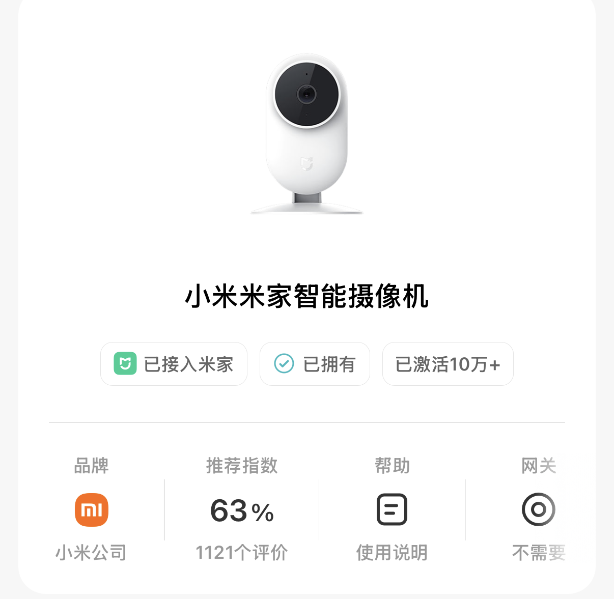
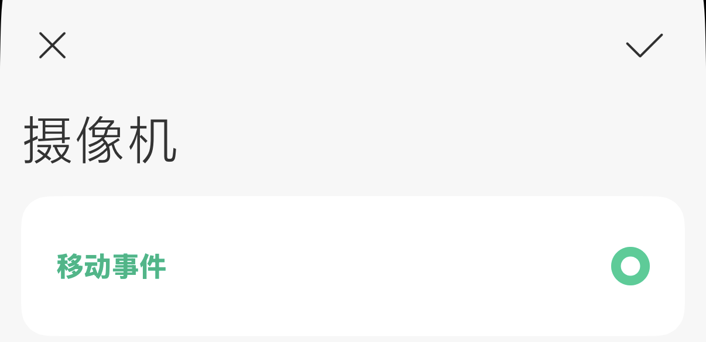
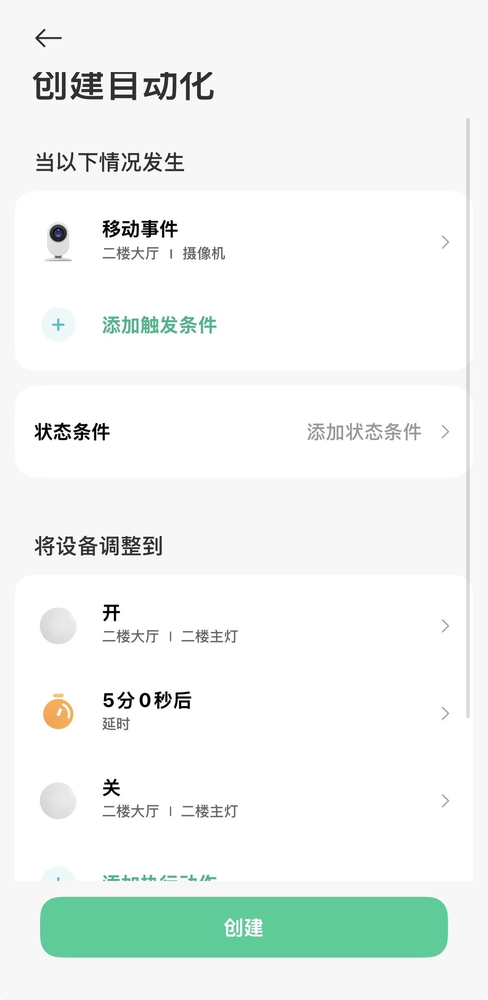
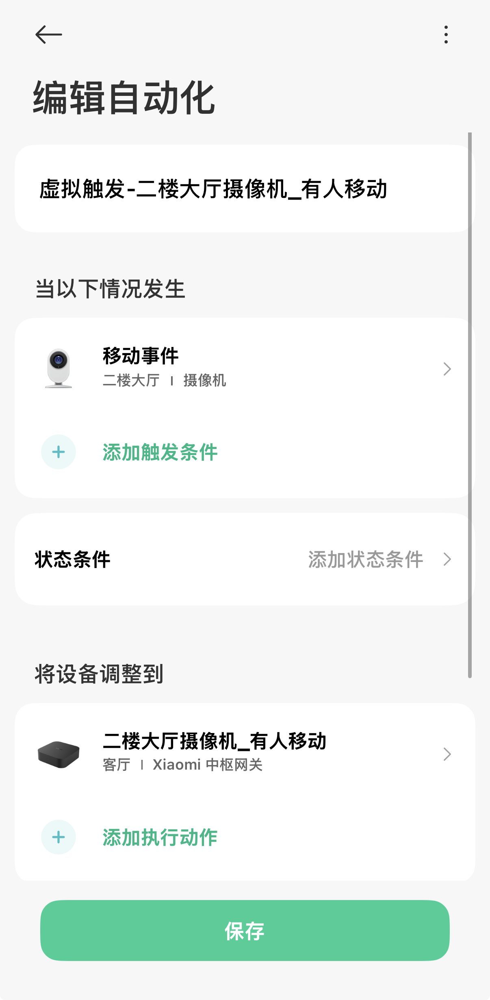
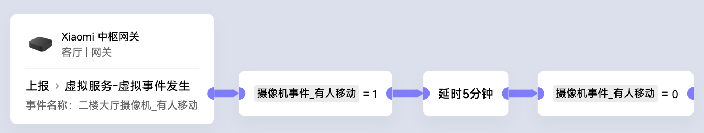
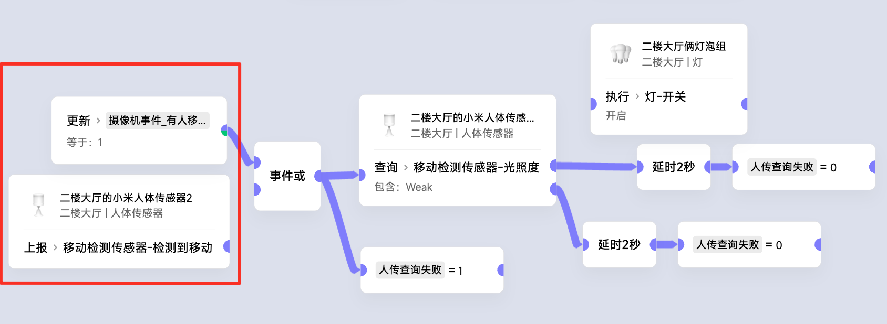

# 利用摄像头当传感器

## 知识储备：
1. 虚拟事件
2. 延时打断机制
3. 极客版变量使用

### 以一个多年前的低端摄像头为例...
- 
  

### 我们利用它的这个触发条件：
- 

## 一、简单的app开关灯场景Ex：
- 
  
## 二、复杂场景
1. 先让中枢产生一个虚拟事件
- 

2. 用极客场景构造有人/无人状态
- 

3. 极客场景使用状态变量的示例
