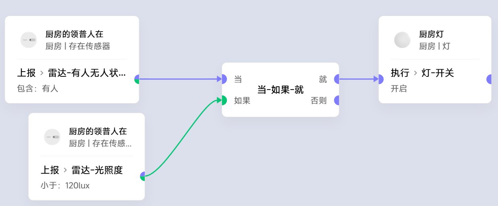
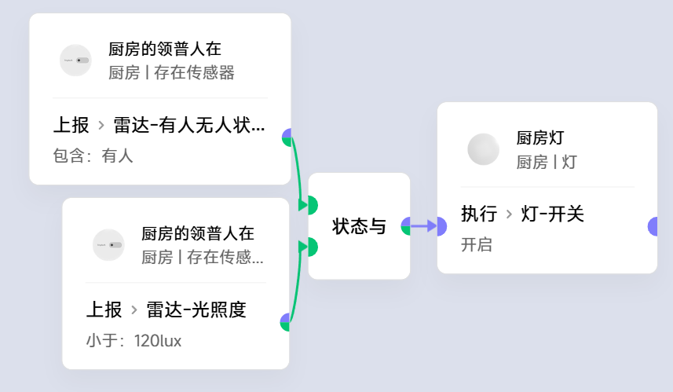
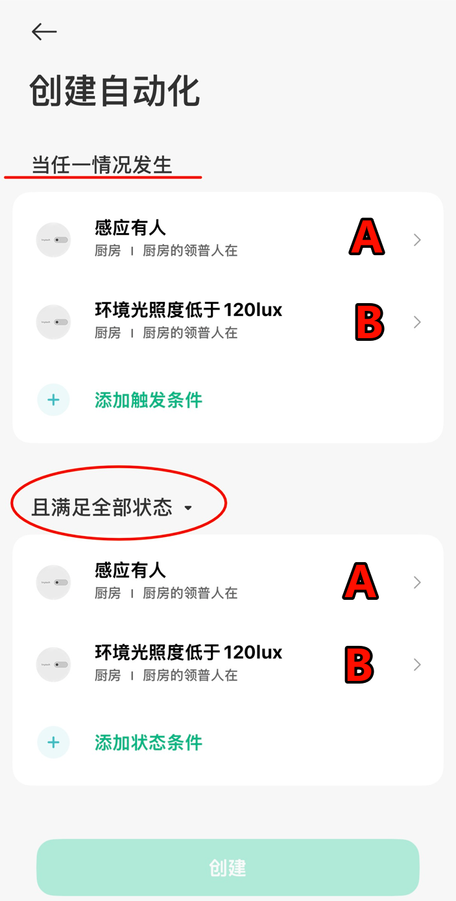
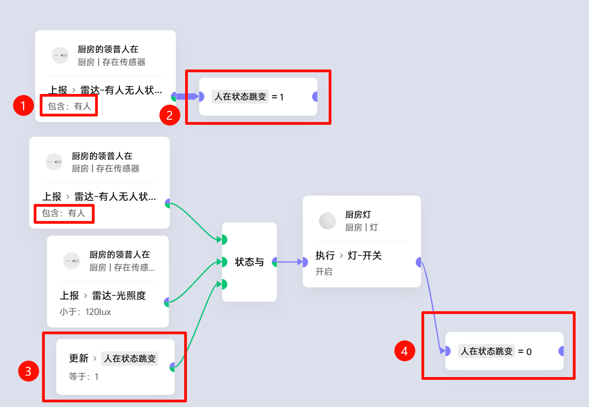

# 巧用满足全部条件的卡片

## 从一个最简单的开灯逻辑例子开始：

  
但其实并不完美，试想：
- 触发有人的时候正好外面天亮，不开灯
- 一直维持有人的状态，但下午某个时刻天黑了，光照度为暗条件满足
- 但已经没有触发条件来触发检查了
- 所以此时并不会自动开灯

## 优化一下：

此时相当于APP场景老生常谈的多个传感器融合的公式：
- 此公式可以做到：
    - 几个条件要求全部满足，
    - 但满足的先后顺序无要求，
    - 当某个时刻，所有条件全满足后。触发执行
    - 假设有4个条件：A、B、C、D
- 触发: A或B或C或D
- 状态: A与B与C与D

此时光照度变暗时又触发一次检查，同时状态有人，就开灯了

但依然存在一个隐性的**问题**：
- 试想此时有人在**传感器范围内**手动关**灯**
- 光照度状态变暗，同时状态有人,灯立马又**开**了

## 思考
我们此时希望的其实是：
- 依然以传感器**有人/无人**为**主条件**
- 同时以光照度暗为**辅助条件**
- 可以等待**辅助条件**延迟满足
- 但不可以完全由辅助条件来触发执行

在这个例子里一句话总结：
##### 光照度为暗的条件可以延迟满足，但触发开灯必须至少有一次传感器从无人到有人的跳变
把问题再抽象一层就是：
- 若干个条件可以拆分成**主条件**和**辅助条件**
- 要触发执行，所有**主条件**必须要从不满足变成满足的跳变
- **辅助条件**无变化要求

## 最终场景

#### 处理方式
1. 把主条件拿出一份
2. 满足主条件后，把变量置1
3. 把变量条件也加到状态全部满足里面
4. 执行成功后把变量重置回0
#### 此时保证了：
- 只有**主条件**变化后才触发执行
- 如果只有**辅助条件**变化，不会触发执行
  
#### 再以举例场景为例：
1. 天亮的情况下，传感器触发有人，**人在状态跳变**这个变量设为满足条件的1。此时光照度为暗条件不满足，不开灯
2. 传感器状态一直维持有人，太阳下山了，光照度为暗条件满足了，开灯
3. 开灯后：光照度为暗条件不满足了；**人在状态跳变**这个变量条件也不满足了
4. 有人在传感器范围内因各种原因临时想要手动关灯，此时光照度为暗条件又满足了。但是由于**人在状态跳变**这个变量条件不满足，所以灯一直不会开
5. 直到传感器触发无人、之后又再次触发有人之后，才会有可能开灯
##### 如果要在米家APP场景中要写这个逻辑的话，把变量换成开关按键、小夜灯啊之类的实物即可，其它与极客版场景同理

## 总结
#### 术语：
- **多条件融合**：无先后顺序要求，只要某个时刻所有条件同时满足了，就触发执行
- **主条件**： 必须要有从不满足变成满足的跳变
- **辅助条件** 无跳变的要求
#### 总述
- **多条件融合**的场景中，可以直接用**满足全部条件**(简化卡片叫状态与)
- **多条件融合**的场景中，可以有主条件和辅助条件来**更细致化**处理场景逻辑