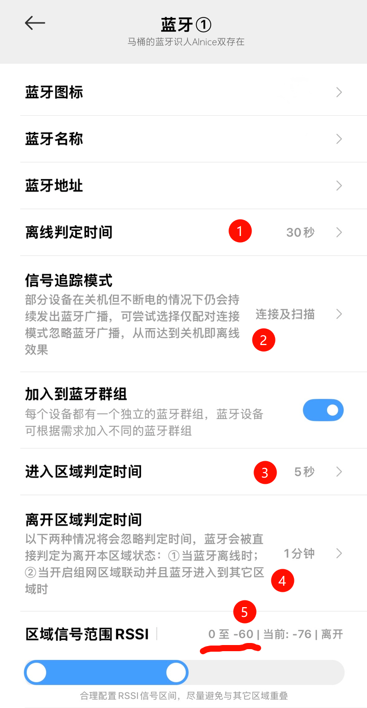
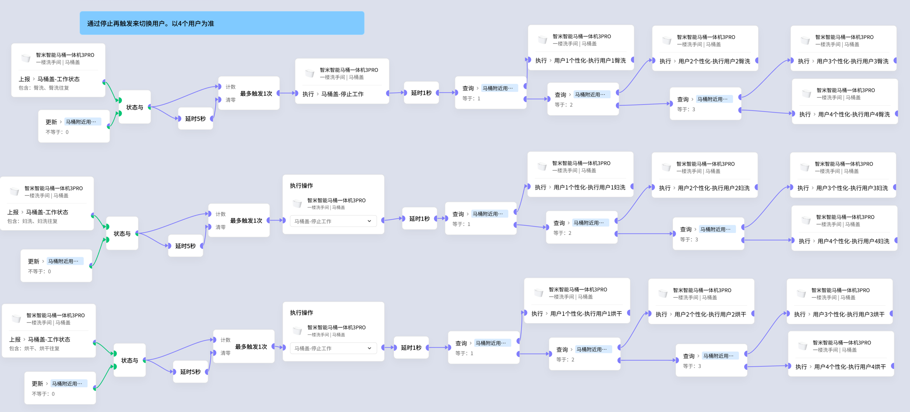
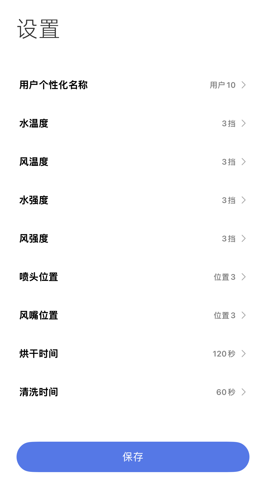

# 马桶识人技术

##### 只要在马桶里装一个摄像头，然后利用菊花视觉识别模型即可轻松区分出这是谁的屁股~

[哔]

开个玩笑，别被吓着啊各位智能家居的小伙伴~

我们只需要一个**Ainice双存在传感器**即可，原理是它可以用手机蓝牙的信号强度，来判断手机和传感器之间的大致距离，这个传感器主要是被用于离家模式、回家模式的判断的，但是看过我这个教程的小伙伴们可就有福啦~

教程开始：
1. 首先把手机和Ainice传感器配对
2. 之后在Ainice页面找到蓝牙设备页按下面设置

3. 写极客场景构造识人的状态变量

看到这不知道有没有小伙伴要问一个问题：“我获取到了这个变量有什么用啊?”

##### 这是一个我实际在用的场景

- 场景看着很乱，但是这个锅在于：马桶的厂商提供的联动太不专业，后面可能会出个视频专门来吐槽。
- 场景用一句话解释其实就是：不同的人上厕所时，臀洗/妇洗/风干的水势/水温/喷嘴位置/喷水时长/风温/风力大小/烘干时间 都是不同的

为什么坚持要用**执行用户1臀洗**这个执行，而不是在识别到用户ID后，就提前设置好一组配置直接写到场景里呢？

这是因为APP上可以修改，更灵活。而且即使直接设置配置，场景的复杂度也并不会降低，可读性反而会变差。

最近又买了一个马桶，这是我买的第三个马桶，第二个接入米家的智能马桶，最近整理了几个马桶相关的玩法，比如小便识别啊什么的~ 如果感兴趣的话，可以蹲一波后续视频