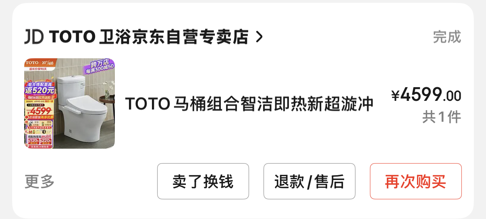
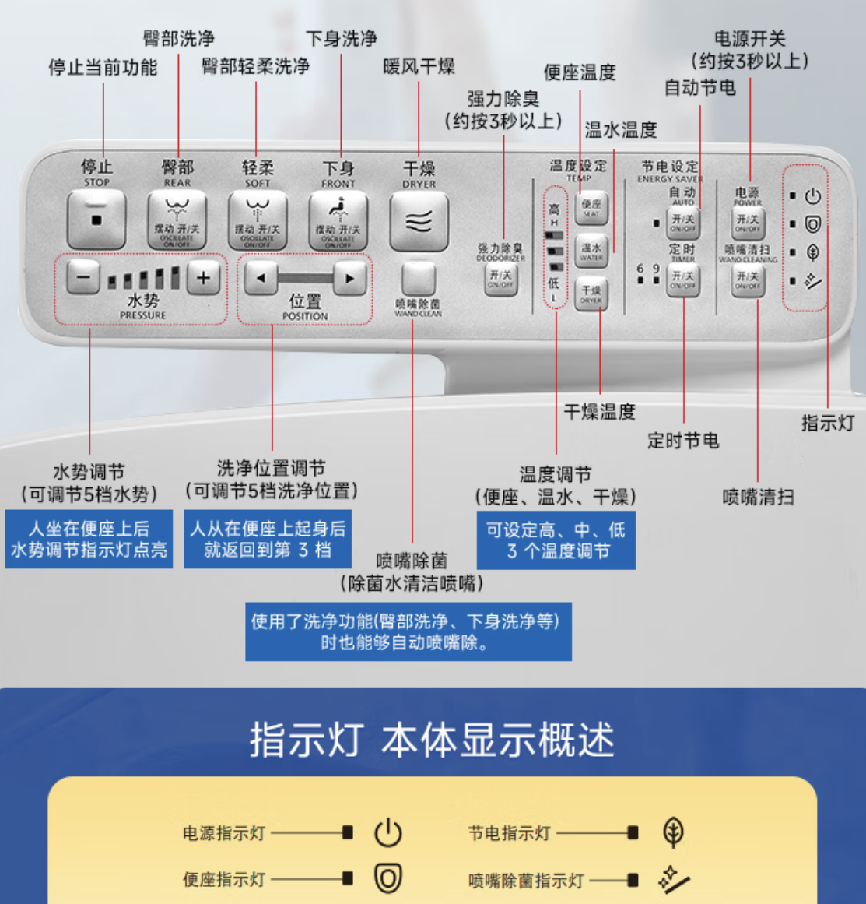
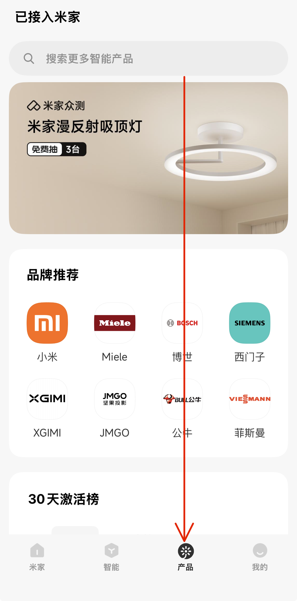
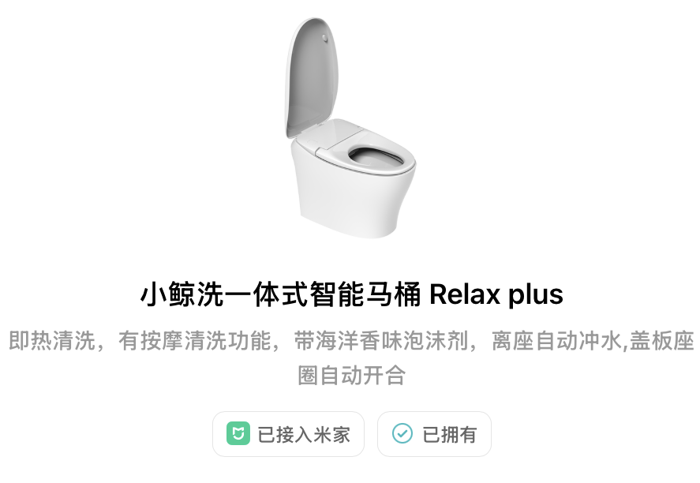
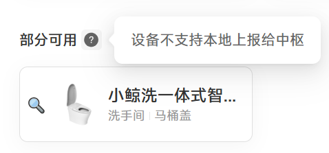
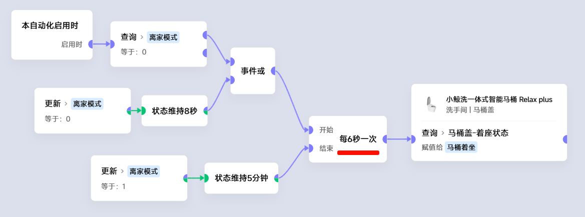
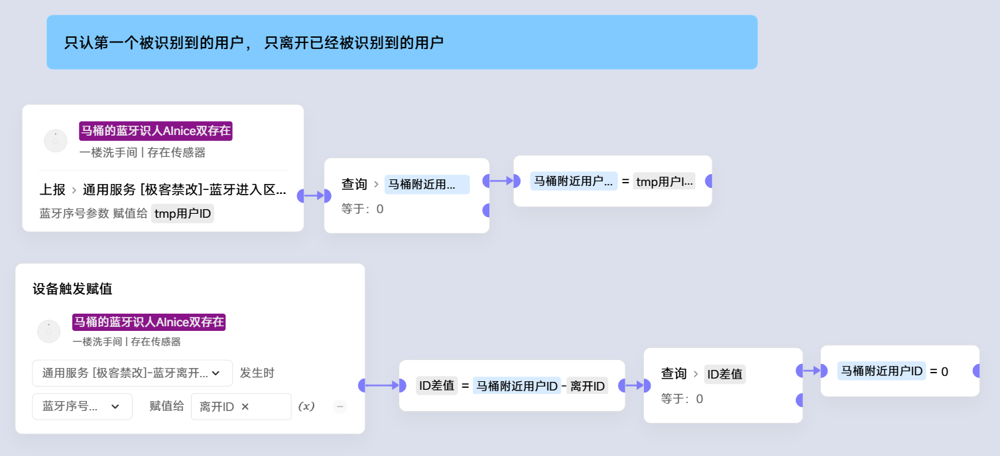
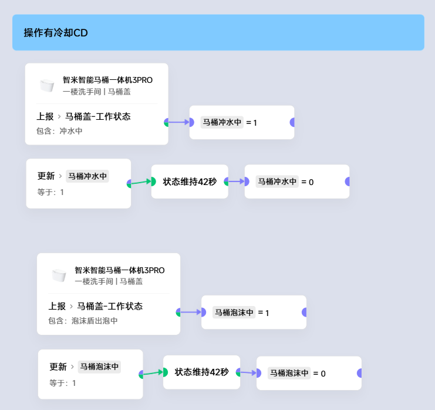
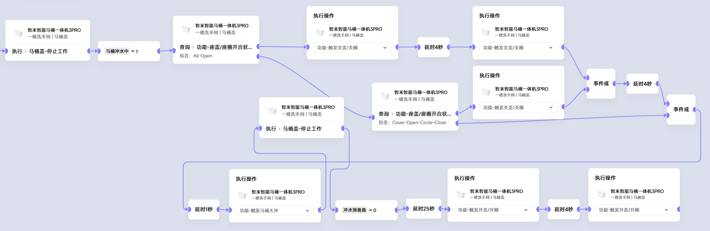

# 马桶选择
本教程不涉及任何广告，请放心食用

马桶这种大件耐用品，从下单的那一刻开始，就意味着它要陪我们度过以年为单位的时光，所以选择非常**重要**~
## 不能接入到生态的非常不推荐买 ！！！

这是21年底时，那时刚刚开始触智能家居，还不明白**生态的力量**。于是买=了一个所谓的“智能”马桶。选择它主要是因为品牌比较知名

可以看到它的功能也不少，但问题在于它所有的功能都是提前设置好的统一的配方，但智能家居所追求的是私人订制，每个人的需求都略有不同。因此这种马桶其实称之为**电动马桶**更为贴切。

## 紧接着又等来了买马桶的机会
用过了TOTO电动马桶之后，我的米家智能家居的设备数也慢慢多了起来。于是明白了**生态的力量**。大家可以选择别的生态，但我们将目光先转到米家的生态来，底层原理都是一样的。

23年底，新房装修收尾了，这次我不相信传统马桶品牌能把智能联动做好了，于是对照着米家产品百科一点点选啊选，

最终买了互联网品牌的这一款

当时买它的时候感觉像是是在赌博，因为当时小鲸洗有好多个不同的型号，我也不知道下单的和我在产品百科里看到的是不是一样的。直到收货安装好通电后，悬着的心才放下来。

这里给大家分享一下米家生态中一个很实用的工具，这个**米物百科**小程序可以看到产品详细联动，包括极客版。

<video controls src="米物百科.mp4" title="Title"></video>

但是由于厂商固件开发的时候，没考虑到米家在22年底放出的大招：**极客版**,导致马桶无法在极客版里主动上报联动条件

如果用app场景当触发，又不能本地化，所以这是个问题，但好在可以用强大的极客版场景解决它：

这样做不会给中枢太大的压力，延迟期望大概是3秒，这对于马桶来说是完全可以接受的。

这样只解决了着座状态的问题，其实马桶有很多条件都可以拿来联动，但是由于嫌麻烦，我只用这个方法处理了着座问题。

那么有人可能就要问了，你一直在说联动联动，具体有什么用呢？你实现了什么功能呢？

那我就基于这个并不完美的联动条件的小鲸洗马桶，来介绍一下我实现的3个联动、场景、或者说功能：
#### 一、 无感知静音冲水

1. 我在马桶背面放了一个对距离处理比较优秀的子擎Lite传感器,距离设置为1.1m,有人判定时长和无人判定时长都是10s。这样可以精准识别到男生小便。
2. 马桶本身的**离座/着座**状态可以精准识别到坐在马桶上。
3. 识别到以上两种状态后，马桶进入等待冲水的状态，并打开马桶的夜灯来反馈
4. 洗手间没人后，马桶关盖冲水

#### 二、 配合人传关灯

1. 人传传感器对于静止的人容易误判无人，但是体积小、价格便宜、不需要电源走线、只对红外感知，振动啊、马桶盖之类的都不会干扰到人传判断。
2. 人在洗手间基本上只有坐在马桶上时动作比较小
3. 人传无人+马桶离座，两个条件同时满足才关灯，解决了人传的缺点，个人认为是洗手间里的黄金搭档。

#### 三、 智能翻盖

1. 站着小便比坐下上厕所要频繁得多(我家的情况是这样，以此为原理介绍，男权女权勿惊)
2. Ainice传感器可以通过蓝牙判断男生的手机是否在家
3. Ainice传感器可以判断谁的手机在马桶边上
4. 当男生在家时，默认马桶除了冲水时，坐圈和盖板全开。
5. 当男生离家时，默认马桶除了冲水时，坐圈放下，只开盖板。
6. 男生到马桶附近，坐圈和盖板全开。
7. 女生到马桶附近，坐圈放下，只开盖板。

## 在出这个教程前的一周又买了个马桶

这次吸取了之前小鲸洗**没有触发联动**的教训，又买了个带触发的，型号也比较新的：

<video controls src="智米马桶米物百科.mp4" title="Title"></video>

但是跟头栽到了执行上：
#### 1. 首先是执行粗看很NB，还有5个用户可以自定义。

但是却没有切换用户的执行，执行里只有这种

<video controls src="马桶执行用户个性化.mp4" title="Title"></video>

这也就意味着如果我要写个性化用户的联动，本来只需要一个指定用户ID的卡片就可以，但是现在却要这么丑陋的对三种执行if if if

用户ID是用**Ainice双存在传感器**(已停产)，根据手机蓝牙信号判断谁在马桶边上的

#### 2. 执行联动有一个内部的CD期
执行的指令和指令之间，有一个CD期，期间这些指令都将**无声失败**(场景日志里显示成功，但实际并未执行)
1. 比如冲水后的40秒内，再收到冲水、出泡沫等指令，马桶会滴滴2声表示拒绝这个执行，有水箱的，但是我家上水大概只要10秒左右，40秒非常不友好，把水位传感器用起来啊！！
2. 出泡沫和冲水一样，也是40秒CD

3. 翻盖、翻圈、冲水之间，有4秒的CD，因此导致一个简单的**合盖合圈->冲水->开盖开圈**的场景，竟然要如此复杂：

# 最后总结一下 从智能家居的角度看，一个优秀的马桶，必须应有的联动条件按优先级：
0. **尽可能少的执行CD或者可以返回一个执行失败**
1. 执行-冲水
2. 状态-着座/离座
3. 执行-泡沫盾
4. 执行-座温
5. 执行-水温
6. 执行-座圈/盖板的开关
7. 状态-座圈/盖板的开关
8. 执行-清理喷嘴
9. 状态-马桶工作状态
10. 状态-滤芯、泡沫液等耗材余量
11. 执行-夜灯、面板灯 等可以当信号灯用于提醒
12. 触发-脚感(把这个触发开放出来到联动里，将会非常有惊喜)