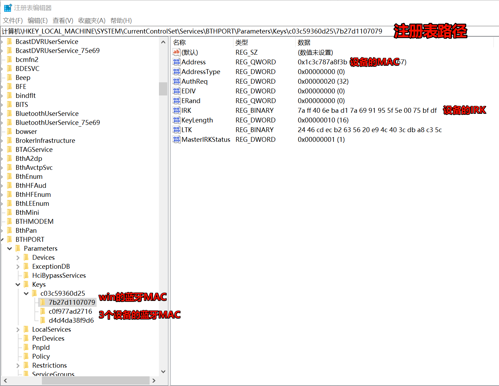

# 蓝牙嗅探

## 一、win下获取到irk (用于蓝牙MAC有加密的设备)
1. 先下载一个 [PS超级管理员工具](https://learn.microsoft.com/en-us/sysinternals/downloads/psexec)
2. 解压后进入目录后执行
```powershell
PS E:\Software\PSTools> .\PsExec.exe -i -s regedit
```
3. 在注册表中找到以下目录:
```
计算机\HKEY_LOCAL_MACHINE\SYSTEM\CurrentControlSet\Services\BTHPORT\Parameters\Keys\
```
4. 之后再找设备的MAC对应的irk即可


## 二、 EspHome配置esp32的板子