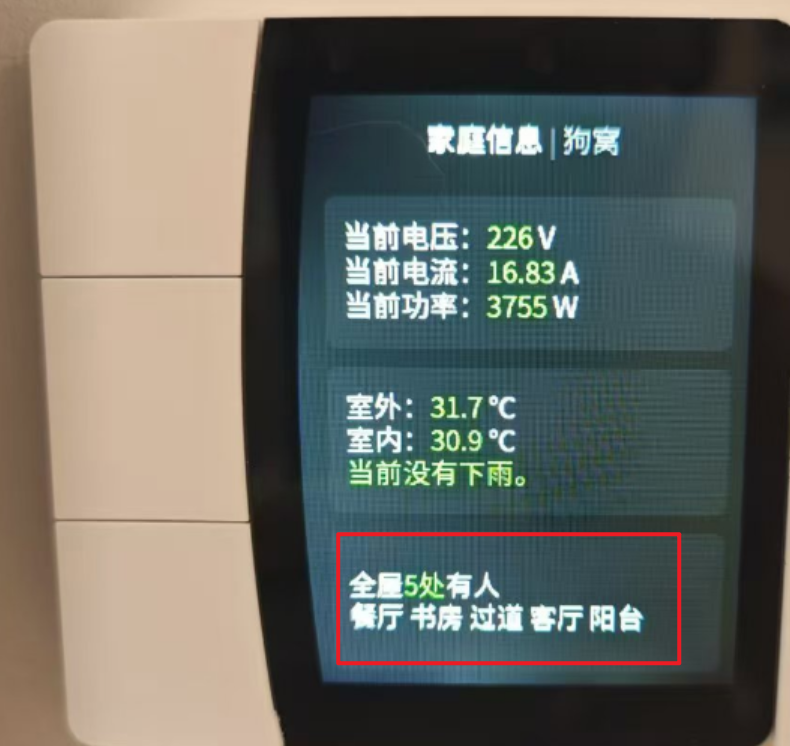
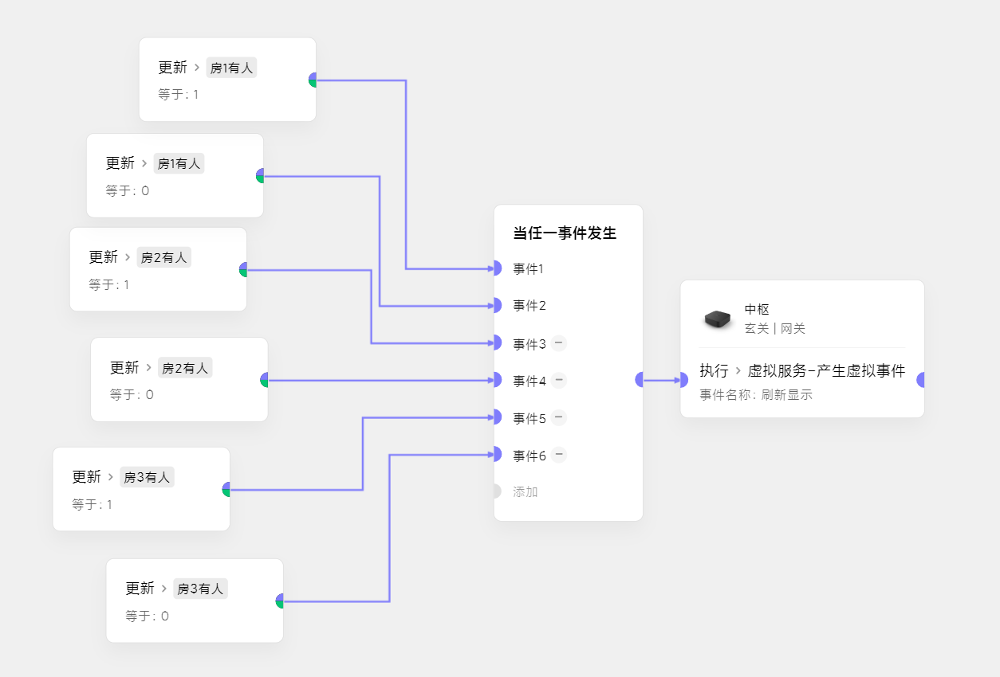
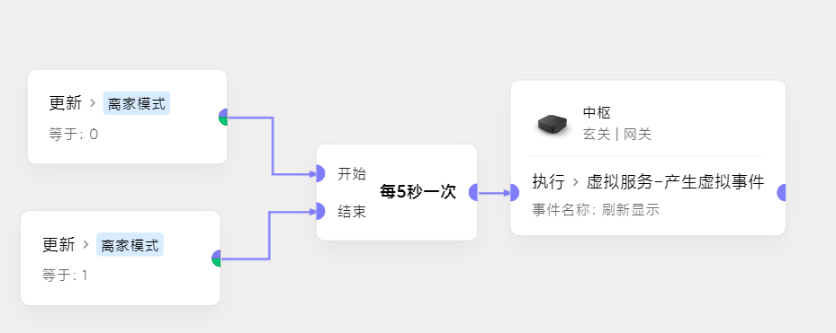
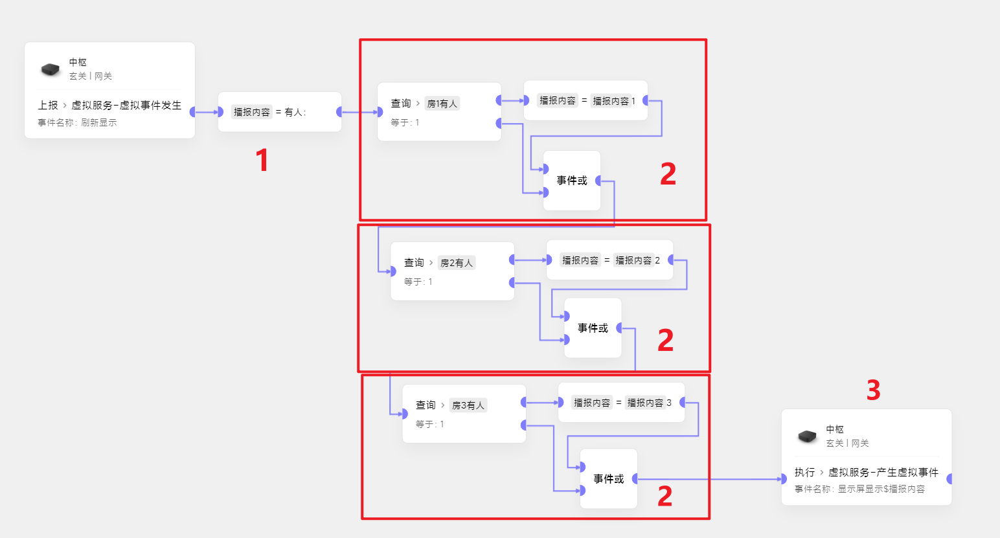

# 领普S2屏幕联动显示状态

## 需求说明
需要在屏幕上显示出当前设备状态，我们以3个传感器状态为例，实现如下效果：

## 实现思路
1. 用一个字符串类型的**变量**，用于存储显示内容。每次触发刷新屏幕时，**初始化变量** 
2. 由于极客版目前还不支持对设备对象的循环，所以我们要写成**遍历**的方式 
   _**n**个传感器，就查询**n**次_
3. 把**组装**好的变量显示到屏幕上
## 极客场景
把这个**刷新屏幕**包装成虚拟事件 
可以选择：
- 当传感器状态变化时(**推荐**)

- 循环调用(传感器过多或者变化过快时) 

为方便简洁，例子中的结果只会显示成**有人：13**,表示房间1和房间3有人。
