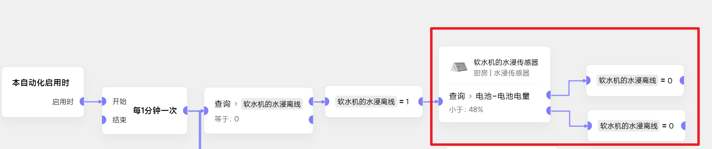
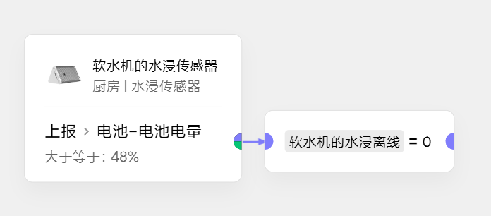
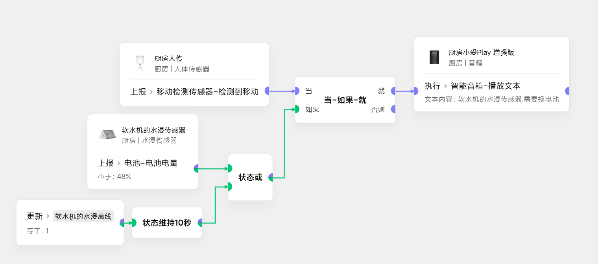

# 领普水浸传感器电池离线及电池更换提醒
## 离线状态获取
### 思路
- 利用设备查询卡片
- 如果设备离线,那么查询卡片(红框部分)**后面的执行都会被抛弃**
- 因此当离线变量为0时，变量先设为1,查询成功后再设回0
- 如果变量维持了10秒都是1,就认为设备离线了
- 最后，如果电量大于48%，再把这个离线**变量复位**
### 实现

## 状态变量的使用
以音箱播报为例
### 思路
区域有人时触发,状态利用**离线变量**和**电量状态**卡片
### 实现
