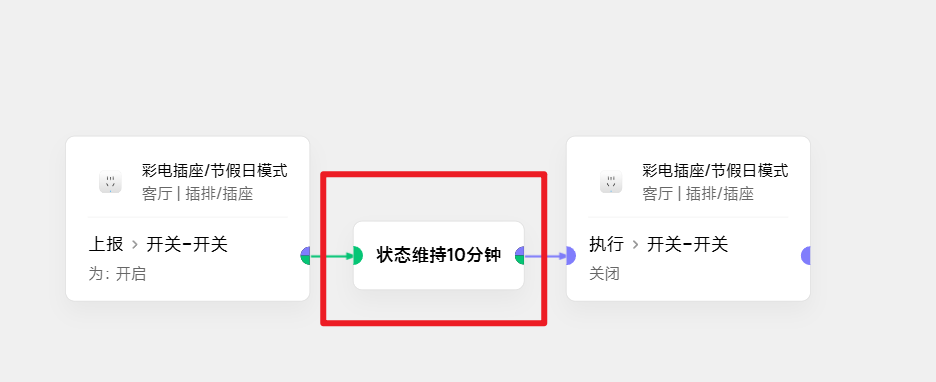
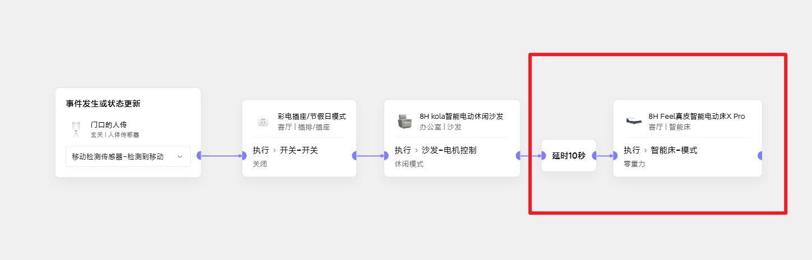
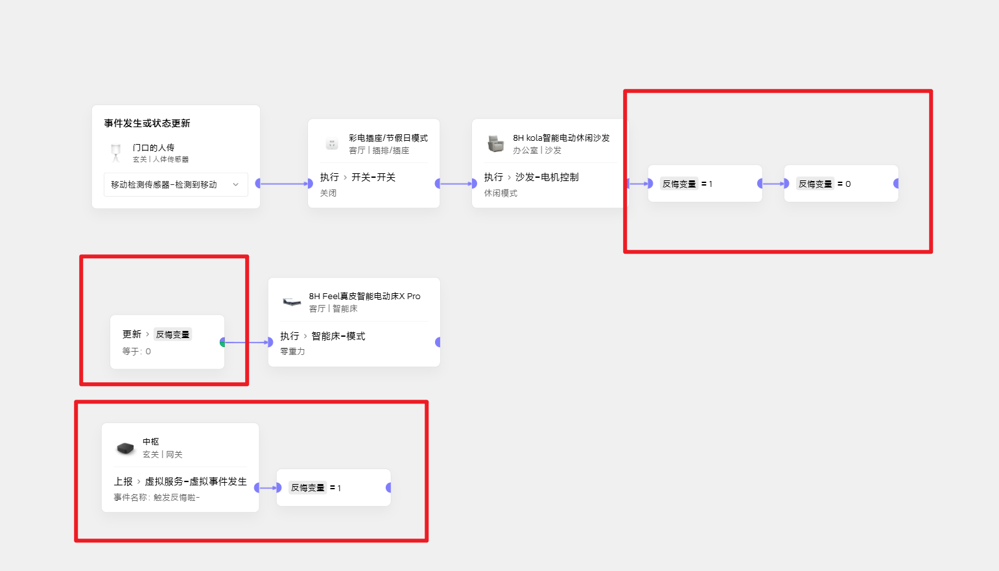

# 延时执行反悔术
## 需求描述
- 如下图一个仅供举例、并无实际意义的 **bad case**:

- 开关打开10分钟后关闭
- 如果我们在第5分钟的时候反悔了
- 怎么中断第10分钟的执行关闭操作呢？

## 思路
- 极客里，绝大部分的**延时**，都可以被**状态维持卡片**上位替换
- 我们把这个场景优化一下：

- 此时有个好处就是，当我们在第5分钟反悔时，只要破坏了维持就行
- 比如此时把它关了，无法维持开启，就也不会有10分钟后的延时

## 进阶
- 有时不是简单的单个延时执行，比如：

- 我们需要在一个特定事件触发之后
- 沙发休闲模式延时10s再执行床的变化
- 但是如果没有特定事件触发、其它情况下沙发休闲模式后不执行床的变化
- 因此不能用刚才那样简单的办法
## 思路
- 我们再次引入老朋友——**变量**
- 用一个反悔变量插在沙发执行之后，并产生一个1->0的变化
- 反悔变量如果维持0一段时间就继续执行后面的
- 如果在维持中间被设置为1了，就**反悔了**
## 实现

