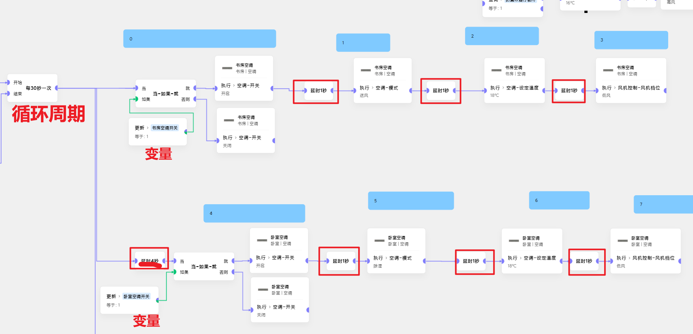

# VRF不同内机在同时执行的485错乱问题
- 中弘
- 首创
- 其它未知，建议接入后第一时间写个测试

## 问题描述
场景联动时，不可避免会出现几乎在**同一时刻**、**不同内机**执行的情况。 
此时会错乱执行。比如夏天突然有一个内机开了制热。冬天突然有一个内机开了制冷 
而这种意外情况，在智能家居中将是**重大事故**
## 原理(猜测)
而485使用高低电平信号通讯，面对多个连续到达的信号，会出现通讯错乱 

## 思路
这个问题抽象后，其实是一个**多线程同步**问题 
首先澄清一个线程同步的经典错误思维：**加延时** 
- 一个t1时间发生的事件A
- 一个t2时间发生的事件B
加延时后无非变成了
- 一个(t1 + t_delta_A)的事件A
- 一个(t1 + t_delta_B)的事件B
等价于原始问题。

## 方案一
解决方案有很多，但受限于米家极客版，我们只能用一个**笨笨版本：**
1. 用一些**全局变量**充当各个内机的开关、温度、风速、模式
2. **场景联动中的**执行空调卡片，只给变量赋值
3. 通过**循环遍历**变量判断并加**延时**，强行将并行事件**串行化** 
4. 可以按需优化开始和结束循环的条件，也可以启用时开始无限循环
5. 循环一定要在秒级，循环周期大于(执行卡片数量)

### 代价
1. 循环导致VRF以及空调485通讯以秒级的方式不停地工作
2. 联动场景有一定(平均延时为循环周期的一半)的延时 
(千万不要在联动中直接执行空调，否则问题又回到了最初的起点)

### 举例

## 方案二
扔了VRF 
换成带红外的空调面板 
通过小爱联动执行

### 代价
没有状态作联动

