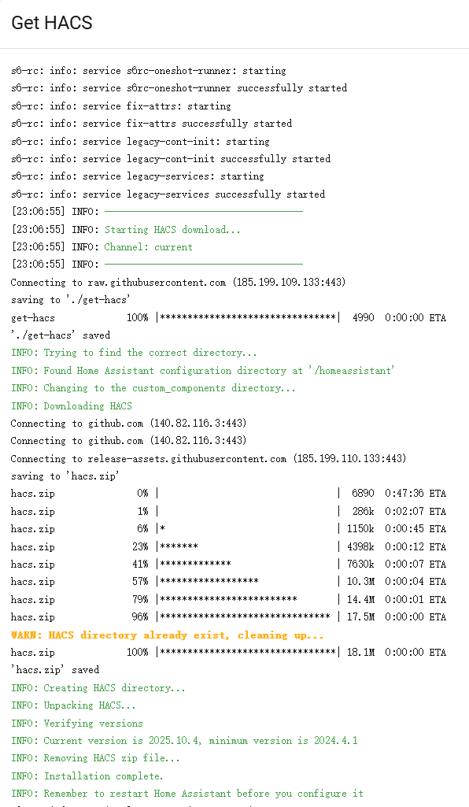

# HACS兼容性问题启动失败如何更新

## 问题描述
由于一些问题导致HACS兼容性等问题挂掉<br>
我的环境中是由于HA很久没有更新，然后一次更新了过大的跨度，导致HACS中有致使Error直接挂掉，又没有UI可以更新，也不是git clone下来的HACS。问题因此陷入了僵局，以下是Error log:
```log
'HomeAssistantHTTP' object has no attribute 'register_static_path'. Did you mean: 'async_register_static_paths'
```
  
## 解决方案
1. 下载一个叫[【get HACS】](https://hacs.xyz/docs/use/download/download/#to-download-hacs)的工具
2. 在**1**中的链接中获取**get HACS**的加载项，如果链接中没法解析出homeassistant的路由，需要手动把它改成你的HA对应的ip，例如我的
    ```
    http://192.168.31.41:8123/_my_redirect/supervisor_addon?addon=cb646a50_get&repository_url=https%3A%2F%2Fgithub.com%2Fhacs%2Faddons
    ```
3. 在**2**的链接中安装 **Get-HACS** 加载项
4. 安装后在**Get-HACS**加载项中点击**启动**
5. 在**Get-HACS**加载项中点击**日志**选项卡，
6. 确认 HACS 下载并返回如下内容：
    
7. 重启Home Assistant
   
## 存在的一些小问题
之前custom rep，如果当前已经在HACS中有了正式版页面，那么将不会显示在custom rep中，需要用户手动先删除掉对应rep(UI or shell cmd都行)，之后再下载HACS商店中的rep即可(比如xiaomi_home)