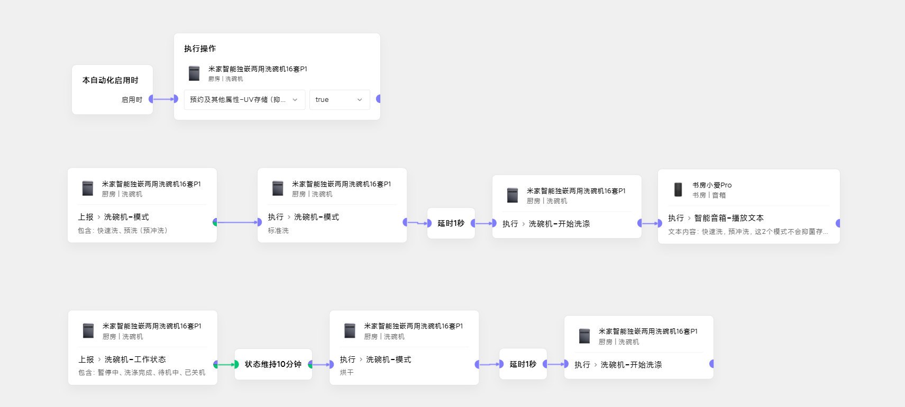

# 米家洗碗机P1_抑菌存储功能
### 现象
1. 快速洗、预冲洗不之后，无法**抑菌存储**
2. **抑菌存储**最长只有7天，之后自动关闭
### 原因 
产品设计逻辑有点。。。
### 解决方式
1. **抑菌存储**的功能要打开
2. **烘干**是可以触发**抑菌存储**功能的
3. 自动化: 快速洗、预冲洗，结束后自动化执行**烘干**
4. 自动化：当前**抑菌存储**状态为假：执行烘干

