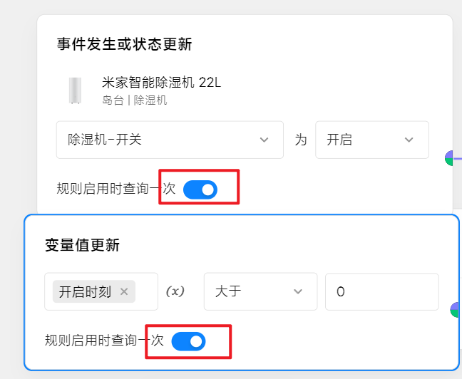

# 中枢3.3.0_0018版本的状态刷新问题

## 问题状态
~~官方**已修复**,软件版本**v0.8.7**版本~~ <br>
0.8.9版本再次出现，对应中枢固件3.3.0_0023
0.9.9版本依然未修复，对应中枢固件3.4.0_0023

## 问题描述
网关重启后，**变量**和**设备**的**状态**，即使打了勾，也不会刷新。<br>
 


## 临时解决方案
把所有的场景**切换关-开**一次. 配了js脚本，原理就是抓到开关button并click，加延时是为了防止意外
```javascript
const switchButtons = document.querySelectorAll('button[role="switch"]');
console.log(`获取到${switchButtons.length}个场景`);
function sleep(ms) {
    return new Promise(resolve => setTimeout(resolve, ms));
}
async function clickAllButtons() {
    for (const button of switchButtons) {
        button.click();
        await sleep(50);
    }
}

// 调用2次clickAllButtons
(async function() {
    await clickAllButtons();
    await clickAllButtons();
})();
```
