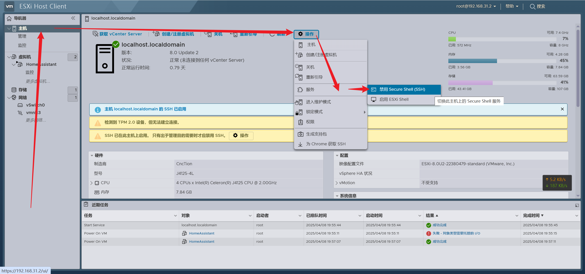

# Homeassistant 虚机报错
```log
失败 - 对象类型需要托管的 I/O homeassistant
```
打开EXSI的ssh连接：<br>

ssh登录到EXSI中，用以下命令解决：
```bash
vmkfstools -x check /vmfs/volumes/6539a555-33ecd498-e4fc-60beb40e9688/HomeAssistant/haos_ova-11.0.vmdk
vmkfstools -x repair /vmfs/volumes/6539a555-33ecd498-e4fc-60beb40e9688/HomeAssistant/haos_ova-11.0.vmdk
```
